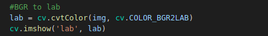
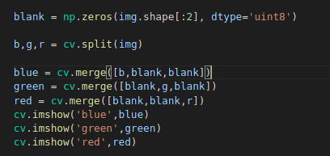
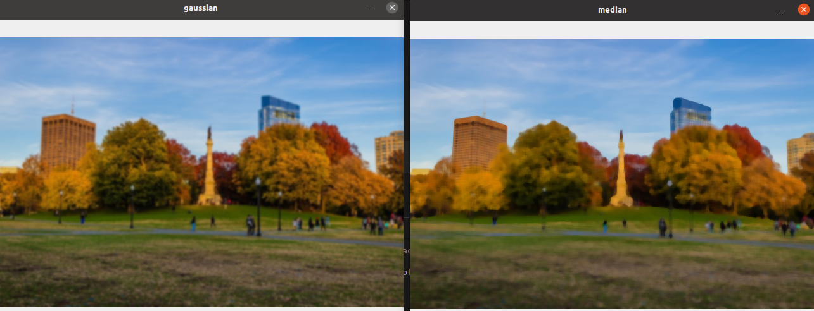
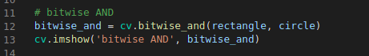
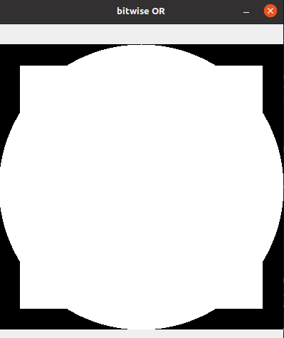
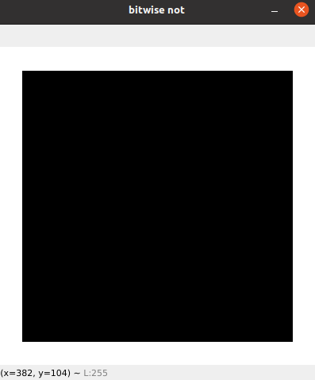

## Screenshots from the lectures 

### color_spaces.py
  
  
  
  
### splitmerge.py
  
  
**lighter regions show higher concentration**  
  
  
  
  
### smoothing.py
  
  
  
  
  
  
  
  
**blurs but keeps the edges**  
### bitwise.py
  
  
  
  
  
  
  
  
  
  
## masking.py
**the mask and the source image should be of the same size**  
  
  
  
  
  
  
### histogram.py
  
  
  
  
  
### thresh.py
  
  
  
  
  
  
  
  
### gradients.py
  
  
  
  
  
  
  
  
  
