## Screenshots from the lectures 
### face_detect.py
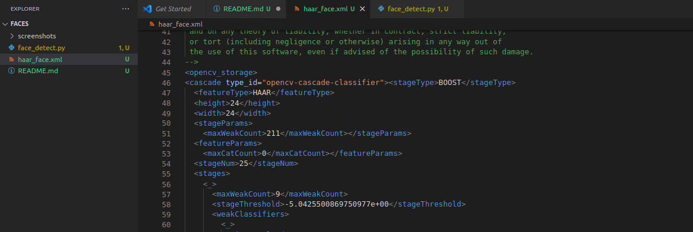  
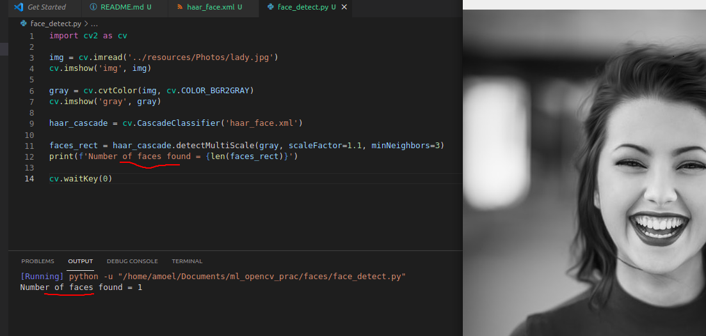  
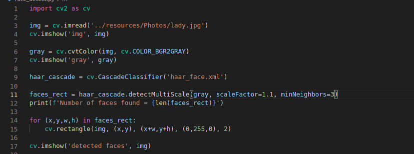  
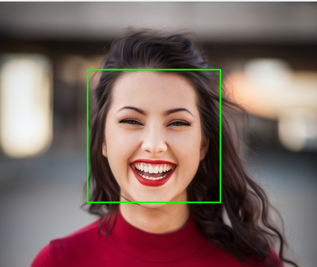  
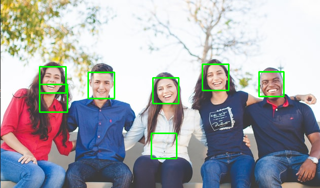  
**haar cascades are really sensitive to noise**  
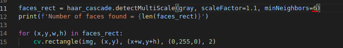  
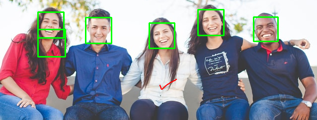  
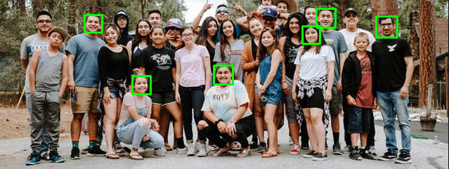  
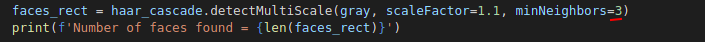  
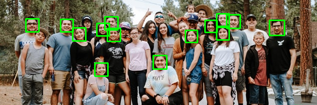  
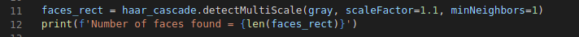  
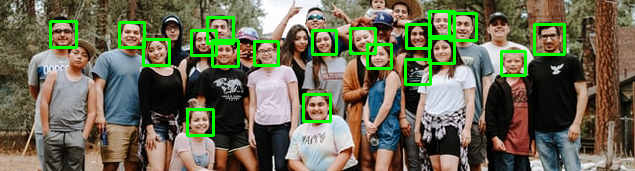  
**but by when you tweak it to detect more faces, it is also more susceptible to noice. so even though haarcascades are popular and easy to use, they're not what you'd use in most real computer vision prokjects**  
### faces_train.py
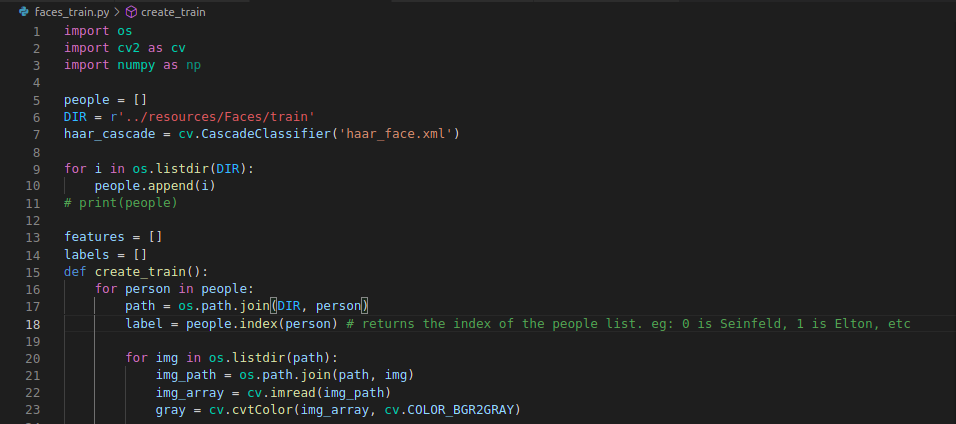  
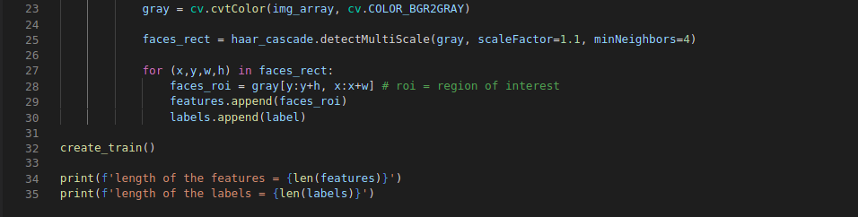  
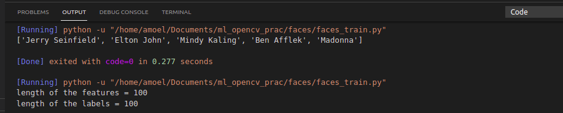  
**the face recognizer is essentially trained now. but if you want to use this face recognizer in another file, we'll have to manually repeat this process of adding those images to a list and getting the corresponding labels, converting that to numpy arrays, etc. opencv allows us to save this trained model, so that we can use it elsewhere, just by using the yaml source file**  
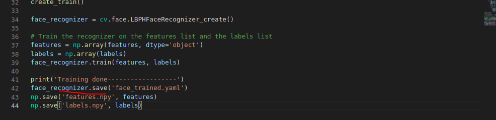  
### face_recognition.py
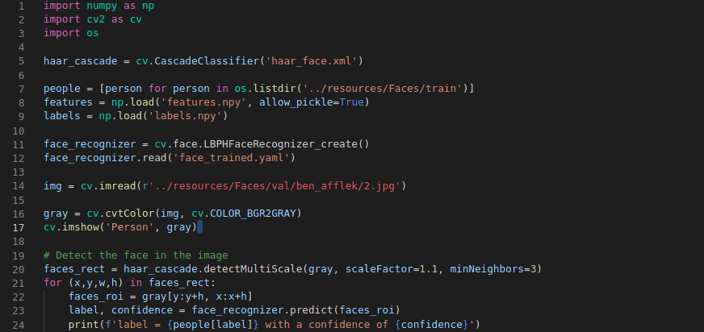  
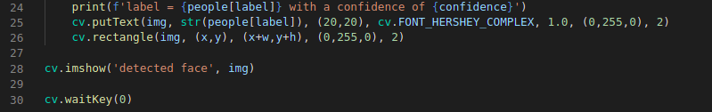  
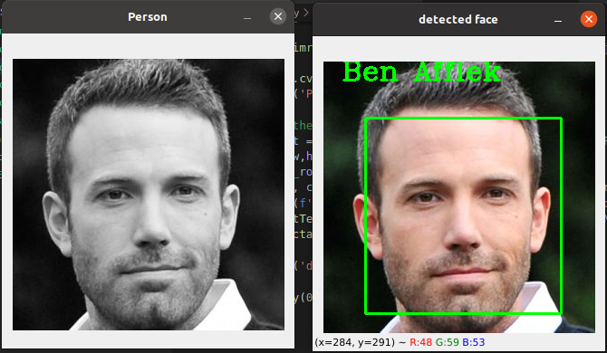  
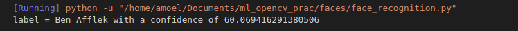  
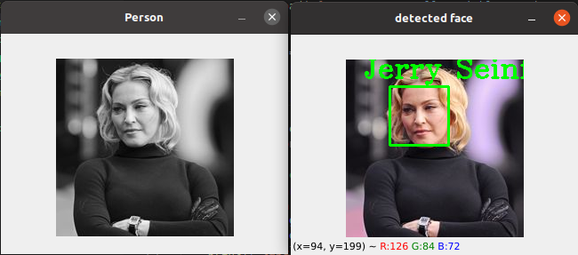  
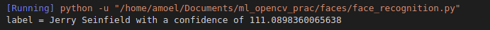  
**we can see that opencv's built in face recognizer is not the best. and we only trained it on a total of 100 images.a deep learning model can perform much better at image recognition**  
### Capstone (train your own ML model)
  
  
**the above 2 packages were created by the author of the video. no need to install canaro if you don't have a GPU. canaro also installs tensorflow by default**  
**get the [simpsons characters dataset](https://www.kaggle.com/alexattia/the-simpsons-characters-dataset) from Kaggle**  
**Go to kaggle.com/notebooks**  
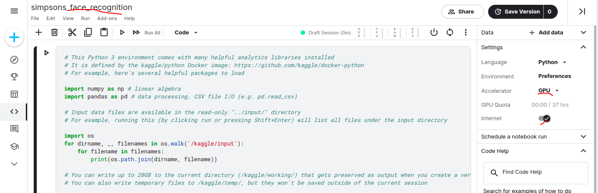  
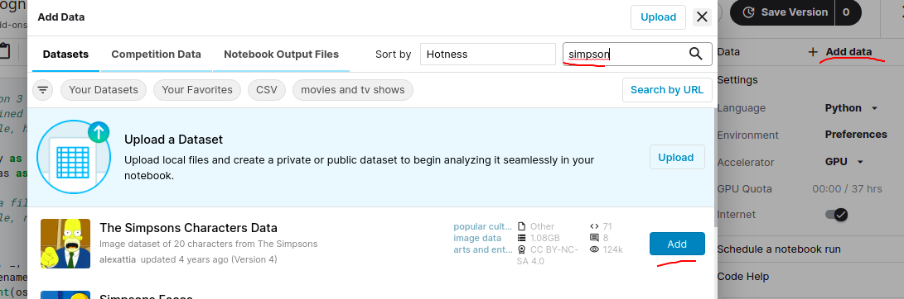  
  
**we also installed caer and canaro in our local machine so that we can experiment and work with it if needed**  
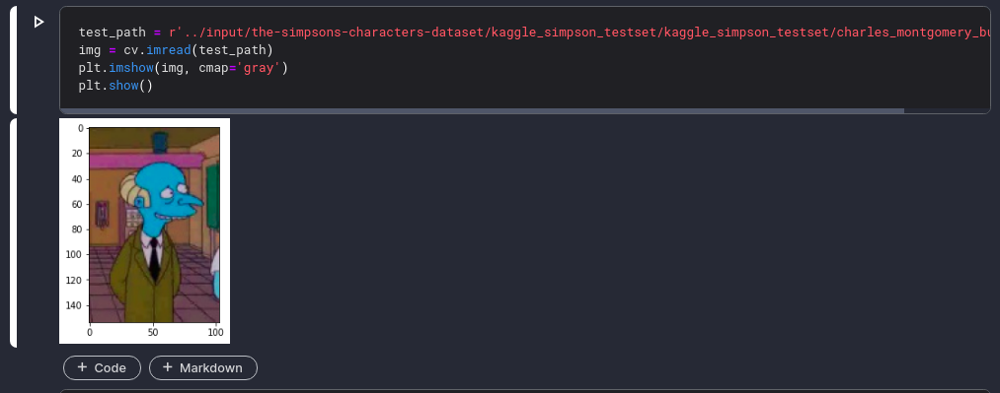  
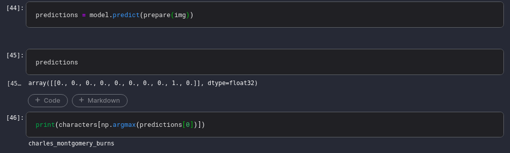  
